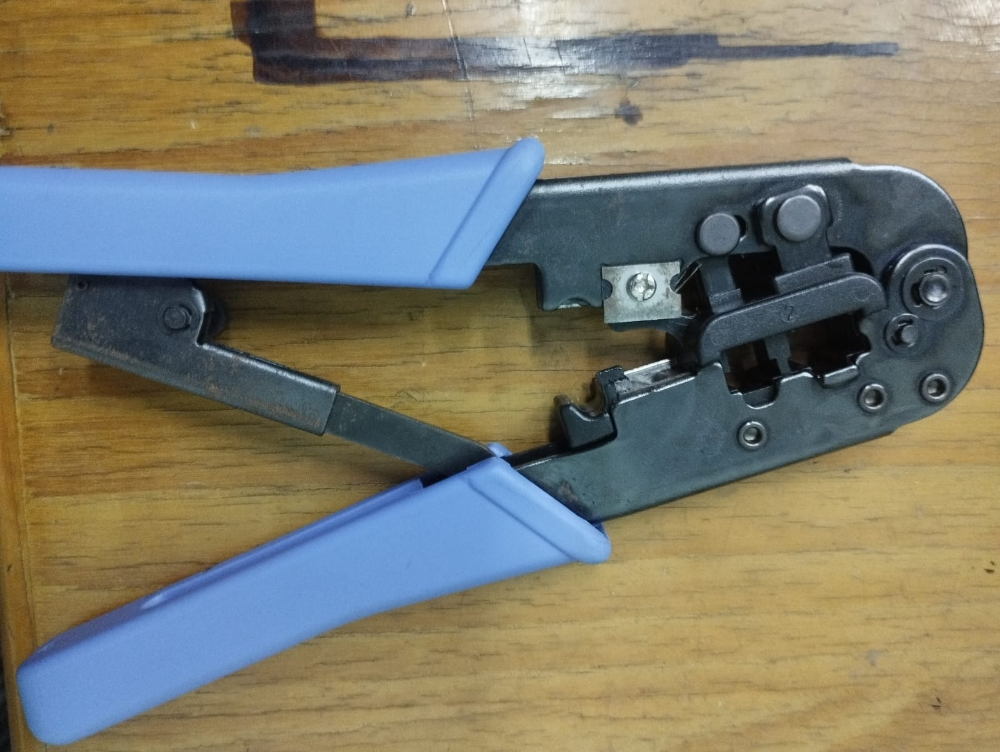
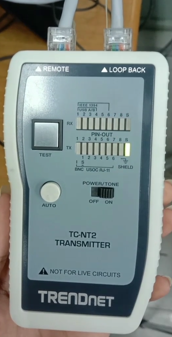
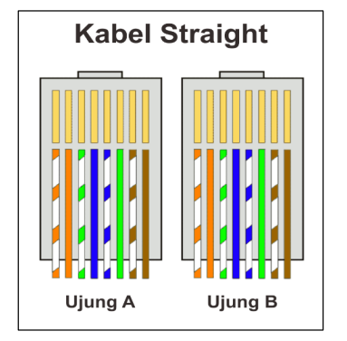
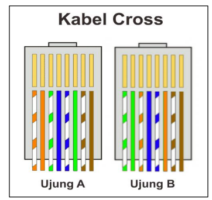

# Laporan Praktikum Jaringan Komputer

Selamat datang di github saya, pada blog ini saya hanya akan menuliskan dan menjelaskan laporan jaringan komputer apa saja yang telah saya pelajarin di kampus.
Saya telah mempelajarin bagaimana cara membuat kabel straight dengan menggunakan kabel STP.
Shielded Twisted Pair (STP) adalah jenis kabel pasangan berpilin yang dilengkapi
dengan pelindung logam untuk melindungi kabel dari interferensi elektromagnetik eksternal.
Keunggulan utama kabel STP adalah kemampuannya untuk melindungi jaringan dari
gangguan eksternal, meskipun harganya lebih mahal dibandingkan kabel Unshielded Twisted
Pair (UTP).
# Alat dan bahan
  - Kabel STP /Kabel UTP

    
  - konektor RJ-45

    
  - Tang crimping

    
  - LAN tester
    
    

# Jenis-jenis teknik pengkabelan
- Kabel Straight :

 

 Kabel straight-through adalah jenis pengkabelan di mana urutan pin di kedua ujung
kabel identik, sehingga kabel terhubung langsung dari satu ujung ke ujung lainnya tanpa
adanya perubahan urutan pin. Cara ini digunakan untuk menghubungkan berbagai perangkat
seperti komputer ke switch atau router
  
- Kabel Crossover

kabel crossover memiliki urutan pin yang dibalik pada satu ujung kabel dibandingkan dengan ujung lainnya. Misalnya, pin 1 di satu ujung terhubung dengan pin 3 di
ujung lainnya, pin 2 terhubung dengan pin 6, pin 3 terhubung dengan pin 1, dan pin 6
terhubung dengan pin 2. Metode ini digunakan untuk menghubungkan perangkat serupa,
seperti switch ke switch atau komputer ke computer (client ke client)

# Cara pembuatan Kabel Straight atau Crossover

